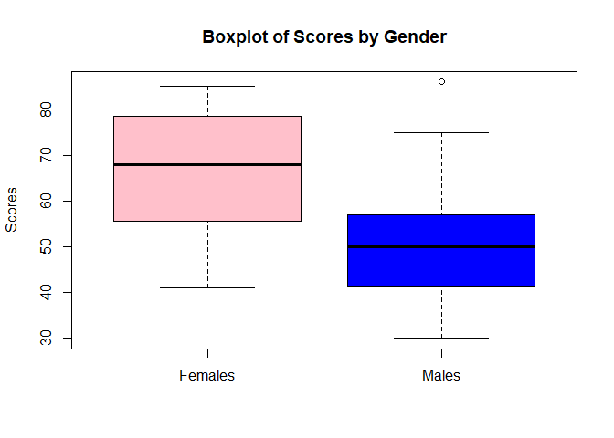

## 1. Write the skewness program, and use it to calculate the skewness coefficient of the four examination subjects in results.txt (results.csv). What can you say about these data?

## Pearson has given an approximate formula for the skewness that is easier to calculate than the exact formula given in Equation 2.1.

### Read the dataset

``` r
data <- read.table("results.txt", header = TRUE)
```

### Compute Normal Skewness

``` r
skew_n <- function(x) {
  mean_x <- mean(x, na.rm = TRUE)  
  sum1 <- sum((x-mean_x) ** 2, na.rm = TRUE)
  sum2 <- sum((x-mean_x) ** 3, na.rm = TRUE)
  skew <- (sqrt(length(x))* sum2)/(sum1 **(3/2))
  skew
}
```

### Compute Pearson’s skewness for each subject

``` r
skew_p <- function(x) {
  mean_x <- mean(x, na.rm = TRUE)
  median_x <- median(x, na.rm = TRUE)
  sd_x <- sd(x, na.rm = TRUE)
  
  return(3 * (mean_x - median_x) / sd_x)
}

subjects <- c("Arch1", "Prog1", "Arch2", "Prog2")

result <- sapply(subjects, function(subj) {
  list(Skewness_Coefficient = skew_n(data[[subj]]),Pearson = skew_p(data[[subj]]))
})
print(result)
```

    ##                      Arch1      Prog1      Arch2     Prog2     
    ## Skewness_Coefficient -0.5195368 -0.3362643 0.4558875 -0.3125144
    ## Pearson              -0.6069042 -0.643229  0.5421286 -0.3562908

### What can you say about these data (Skewness Coefficient)?

In the analysis of the Skewness Coefficient results, Prog1, Arch2, and
Prog2 are fairly symmetrical. This shows that the majority of students
in Prog1 and Prog2 performed well, with some having low scores. For
Arch2, more students scored below average, which explains why a small
group of students is excelling. On the other hand, Arch1 is moderately
skewed, indicating that more students scored above average.

### Is it a reasonable approximation?

Yes, Pearson’s Skewness provides a reasonable approximation in most
cases. In this analysis, comparing Pearson’s Skewness with the Skewness
Coefficient for Arch1, Arch2, and Prog2, the difference between
Pearson’s and Normal Skewness is small, indicating that Pearson’s offers
a reasonable approximation. However, for Prog1, Pearson’s slightly
overestimates skewness.

------------------------------------------------------------------------

## 2. For the class of 50 students of computing detailed in Exercise 1.1, use R to

## (a) form the stem-and-leaf display for each gender, and discuss the advantages of this representation compared to the traditional histogram;

## (b) construct a box-plot for each gender and discuss the findings.

### Define the data

``` r
females <- c(57, 59, 78, 79, 60, 65, 68, 71, 75, 48, 51, 55, 56, 41, 43, 44, 75, 78, 80, 81, 83, 83, 85)
males <- c(48, 49, 49, 30, 30, 31, 32, 35, 37, 41, 86, 42, 51, 53, 56, 42, 44, 50, 51, 65, 67, 51, 56, 58, 64, 64, 75)
```

### (a) Stem-and-Leaf Display

``` r
cat("\nStem-and-Leaf for Females:\n")
```

    ## 
    ## Stem-and-Leaf for Females:

``` r
stem(females)
```

    ## 
    ##   The decimal point is 1 digit(s) to the right of the |
    ## 
    ##   4 | 1348
    ##   5 | 15679
    ##   6 | 058
    ##   7 | 155889
    ##   8 | 01335

``` r
cat("\nStem-and-Leaf for Males:\n")
```

    ## 
    ## Stem-and-Leaf for Males:

``` r
stem(males)
```

    ## 
    ##   The decimal point is 1 digit(s) to the right of the |
    ## 
    ##   3 | 001257
    ##   4 | 1224899
    ##   5 | 01113668
    ##   6 | 4457
    ##   7 | 5
    ##   8 | 6

### Stem-and-Leaf vs. Histogram

The stem-and-leaf plot preserves individual data while showing the
overall shape of the distribution. It provides a more detailed view of
the actual values while still displaying the distribution. On the other
hand, histogram is better used for larger data sets where you want to
observe the general shape of the distribution.

------------------------------------------------------------------------

### (b) Boxplot Comparison

``` r
boxplot(females, males, names = c("Females", "Males"), 
        col = c("pink", "blue"), 
        main = "Boxplot of Scores by Gender", 
        ylab = "Scores")
```



### Interpretation

The boxplot allows us to visualize the spread, median, and presence of
outliers. In the analysis, The median score for females is higher than
for males, suggesting that the middle values of the female data are
generally greater.Also, the range of the female data is wide, but there
aren’t many outliers. On the other hand, the male data has a one high
outlier (86), indicating more variation within this group.
